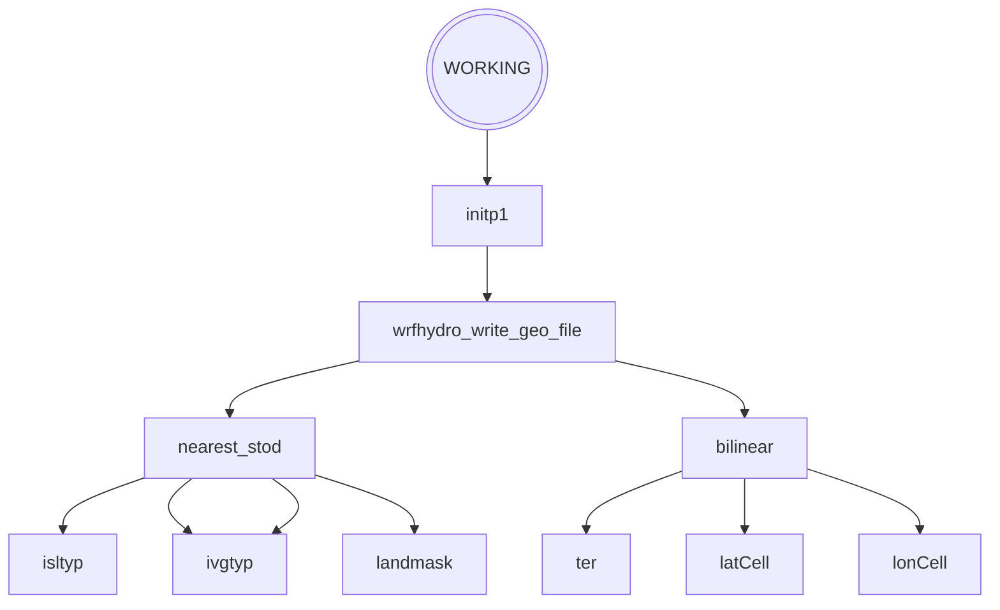
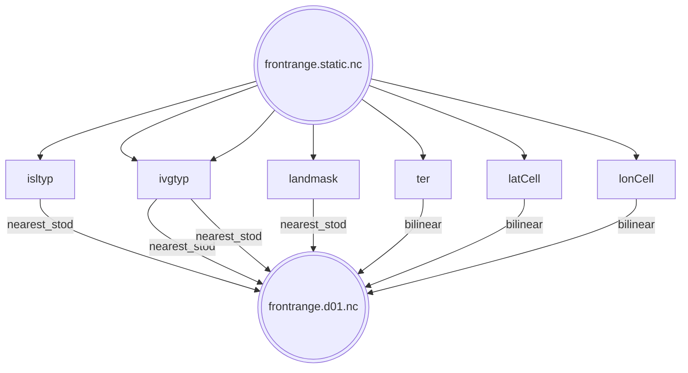

# WRF-Hydro and MPAS Coupling

## Preprocessing Steps
### METIS
Build [Metis](https://github.com/KarypisLab/METIS), it will install in `$HOME/local`
METIS takes the testcase.graph.info file which has all the grid information, and decides
  how to split a mesh node between np partitions.

#### Build METIS
```
# Build Dependecy GKlib
$ cd ${RUN_DIRECTORY}
$ git clone git@github.com:KarypisLab/GKlib.git gklib
$ cd gklib
$ make config
$ make -j 4
$ make install

# Build metis
$ cd ${RUN_DIRECTORY}
$ git clone git@github.com:KarypisLab/METIS.git metis
$ cd metis
$ make config gklib_path=$HOME/local/lib64
$ make -j 4
$ make install
```

#### Run METIS
Run Metis to create `np` partitions where `np` is the number of processes used to run MPI.
```
$ cd ${RUN_DIRECTORY}
$ gpmetis -ptype=kway -contig -minconn -ufactor=1 frontrange.graph.info ${np}
```


### SCRIP
ESMF cannot currently read the native MPAS mesh format.
The MPAS mesh file needs to be converted to SCRIP format so ESMF can easily read the mesh to regrid.

#### Build SCRIP
```
$ conda activate mpas_tools
$ conda install -c conda-forge mpas_tools
```
#### Run SCRIP
```
$ scrip_from_mpas -m testcase.graph.nc -s testcase.scrip.nc
```


### Initialization
TODO: need to run in serial


# Info
## Initializaiton
### Geogrid File Creation from MPAS + NoahMP

| MPAS Variable | description                 | Hydro Geo Var | description                   | Regrid Method |
|---------------|-----------------------------|---------------|-------------------------------|---------------|
| isltyp        | soil type index             | SCT_DOM       | Dominant top layer soil class | Nearest Stod  |
| ivgtyp        | vegetation type index       | VEGTYP        | Vegetation type               | Nearest Stod  |
| ivgtyp        | vegetation type index       | LU\_INDEX     | Land cover type               | Nearest Stod  |
| landmask      |                             | LANDMASK      |                               | Nearest Stod  |
| ter           | terrain height, in .init.nc | HGT\_M        | Elevation                     | Bilinear      |
| latCell       | Latitude                    | XLAT\_M       | Latitude                      | Bilinear      |
| lonCell       | Longitude                   | XLONG\_M      | Longitude                     | Bilinear      |





#### Visualization
The xarray extension [UXarray](https://uxarray.readthedocs.io/en/latest/index.html) is used to visualize the MPAS meshes.
Follow the instructions to [install uxarray](https://uxarray.readthedocs.io/en/latest/getting-started/installation.html)
or if the user is on Derecho they can use an NPL library.
The following commands are specifically for use within a Jupyter notebook.

```python
dir = 'path/to/output'
init_f = dir + 'frontrange.static.nc'
output_f = dir + 'history.2013-09-10_00.00.00.nc'

# the arguments
init = ux.open_dataset(dir+"frontrange.grid.nc", init,
    decode_times=False, grid_kwargs={"decode_times": False, "drop_variables": ["Time"]},)
mpas = ux.open_dataset(dir+"frontrange.grid.nc", output_f,
    decode_times=False, grid_kwargs={"decode_times": False, "drop_variables": ["Time"]},)
```

The simplest way is to use `.plot()`.
This will not work if there are Python statement that follow it due to implicit output,
  which automatically displays the value of the last expression in a cell.

```python
mpas['isltyp'].plot()
```

The `.plot()` will return a plot object that can be used later.
This is extremely usefull for plotting meshes side-by-side with the `(p1 + p2)` statement.

```python
p1 = mpas['vegfra'].isel(Time=0, drop=True).plot()
p2 = mpas['isltyp'].plot(cmap='tab20')
(p1 + p2)
```
