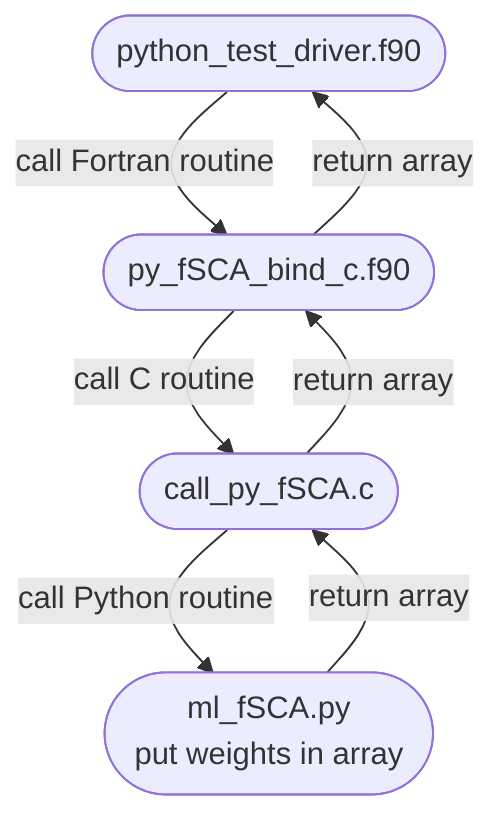

# Prerequisites
Turn on Python coupling during CMake initialization.
Make sure Conda environment is loaded before modules.

## Setup Python Environment
```
$ conda create --prefix /path/to/wrf-h-ml
$ conda activate wrf-h-ml
$ conda install -c conda-forge scikit-learn xgboost xarray netcdf4 joblib
```

## Load Modules
```
$ conda activate wrf-h-ml
$ module purge
$ module load ncarenv gcc cray-mpich netcdf cmake
$ module load conda
```

# Build
```
$ mkdir build
$ cd build
$ cmake ../ -DPYTHON_FSCA=1
$ make -j 4
```

# Run Test Driver
From `build` directory
```
$ make install
$ ./bin/call_python
```

# Flowchart



# Input Variables
The static variable information comes from files like `geo_em.d01.nc`.
WRF-Hydro forcing variables are kept in `module_NoahMP_hrldas_driver.F` and the
static variables are kept in `module_RT_data.F90` and `?`.
|---------------|-------------------|---------------------------------------------------|---------|
| Variable      | WRF-Hydro Name    | Description                                       | Type    |
|---------------|-------------------|---------------------------------------------------|---------|
| `T2D`         | `T_PHY`, `T2`     | 2-m Air Temperature                               | Forcing |
| `LWDOWN`      | `GLW`, `XLONG`    | Surface downward long-wave radiation flux         | Forcing |
| `SWDOWN`      | `SWDOWN`, `SHORT` | Surface downward short-wave radiation flux        | Forcing |
| `U2D`         | `U_PHY`, `U`      | 10-m U-component of wind                          | Forcing |
| `V2D`         | `V_PHY`, `V`      | 10-m V-component of wind                          | Forcing |
| `day_of_year` | `%olddate(1:19)`? | Day of the Water Year                             |         |
| `HGT`         | `TERRAIN`         | Topography height                                 | Static  |
| `slope`       | `?`               | Slope                                             | Static  |
| `aspect`      | `?`               | Direction a slope faces, calculated from COSALPHA | Static  |
| `lat`         | `latval`          | Latitude                                          | Static  |
| `lon`         | `lonval`          | Longitude                                         | Static  |
|---------------|-------------------|---------------------------------------------------|---------|
