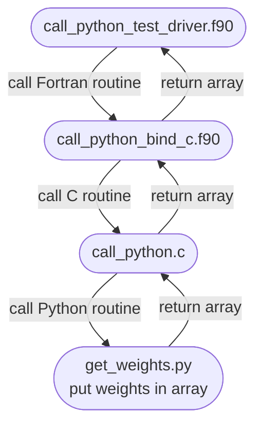

# Prerequisites
Turn on Python coupling during CMake initialization.
Make sure Conda environment is loaded before modules.

## Load Python Environment
```
$ conda create --prefix /path/to/wrf-h-ml
$ conda activate wrf-h-ml
$ conda install -c conda-forge scikit-learn xgboost pandas joblib
```

## Load Modules
```
$ conda activate wrf-h-ml
$ module purge
$ module load ncarenv gcc cray-mpich netcdf cmake
$ module load conda
```

# Build
```
$ mkdir build
$ cd build
$ cmake ../ -DPYTHON_CPL=1
$ make -j 4
```

# Run
From `build` or `bin` directory
```
$ ./bin/call_python
```

# Flowchart

